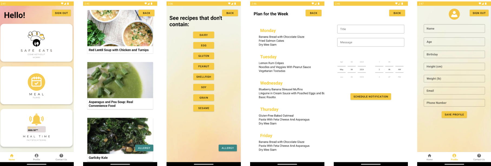

# Plate Perfect

An android app designed to give users the ability to make well-informed decisions about their health and well-being by providing a wide range of features that are customized to accommodate various dietary preferences and lifestyles like suggesting users with different meal plans and recipes and helps the users to be on track with their diet.

 

<h2>Idea Proposal</h2>
Please refer to the link for more details <a href="https://docs.google.com/document/d/1WH4igLCGn2JayA3ci811kjBUjbGURqBT/edit?usp=sharing&ouid=102167781560686034577&rtpof=true&sd=true">Idea Proposal</a>

<h2>Design</h2>
Please refer to the link for more details <a href="https://www.figma.com/file/WaHtcOq8zx3GQMmXaezbxi/Plate-Perfect-Design?type=whiteboard&node-id=0-1&t=BbGVux2QRRN0fjTZ-0">Design</a>
 

<h2>Features</h2>
SAFE EATS : An option to view recipies by filtering out any allergies from a provided list

MEAL PLANS: A proposed meal plan for the entire week, includes 3 meals a day

MEAL TIME NOTIFICATION: Scheduled notifications for meal reminders

POFILE: View user details

CONTACT US: Send an email to the team

<h2>Preview</h2>
 

<h2>Link to Presentation</h2>
Please refer to the link to watch the video <a href="https://docs.google.com/presentation/d/1lNT--YTEpbHwkaYkdSoyn6-U8Dqp6lNT/edit?usp=sharing&ouid=112087055757618843227&rtpof=true&sd=true">Presentation</a>
 

<h2>Link to Demo Video on YouTube</h2>
Please refer to the link to watch the video <a href="https://youtu.be/9klUhgNN0cE">Video</a>

 

<h2>Contributors:</h2>
Christoper Ospina, Sharon Dsouza, Gracia Betty and Saily Jadhav
 

