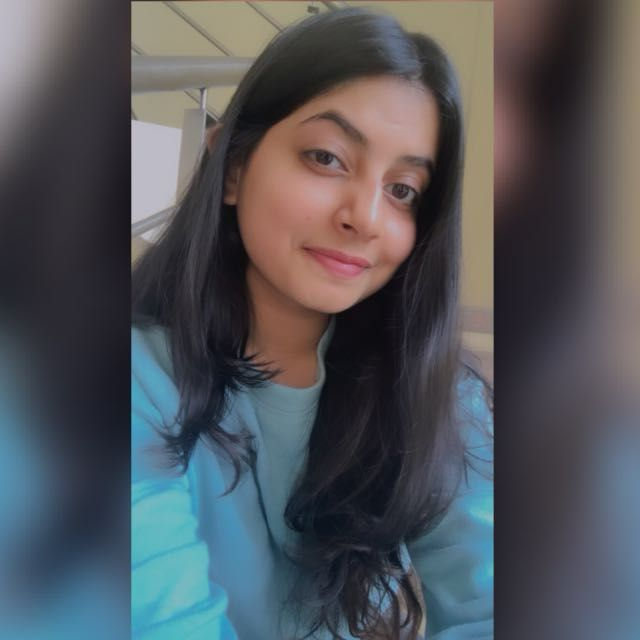

# Final-CS639

<h3>The Final mini-capstone project for Mobile App Development that simulates healthy food planning: PLATE PERFECT </h3>

<h3> Plate Perfect </h3>

 
Please refer to the link for more deatils <a href="https://docs.google.com/document/d/1WH4igLCGn2JayA3ci811kjBUjbGURqBT/edit?usp=sharing&ouid=102167781560686034577&rtpof=true&sd=true">Idea Proposal</a>

 
 

<b><ins>Team Members:</b></ins>
Christoper Ospina, Sharon Dsouza, Gracia Betty and Saily Jadhav

Watch them out for their amazing work here!
 

